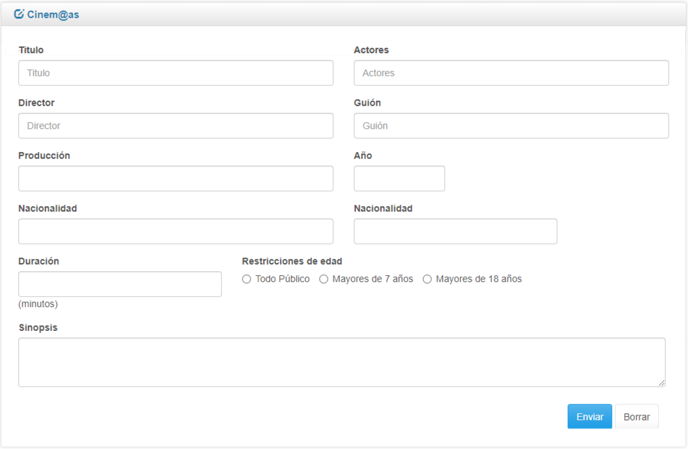

# Trabajo Practico Número 2
### Validación con JavaScript
---
## Ejercicio 1
Investigue y pruebe la validación de formularios usando alguna librería o framework
javaScript (JQuery, Mootools, Dojo, Prototype, etc).
## Ejercicio 2
Seleccionar una de las librerias e implementar la validación de los siguientes ejercicios:
- Realizar la validación de los formularios creados en el TP 2: HTML-PHP. Chequear
que se hayan cargado todos los datos necesarios antes de ser enviados al servidor
y que sean del tipo correcto.
## Ejercicio 3
**a)** Crear una nueva página php con un formulario HTML de login en la que solicitan el usuario
y la password para loguearse. Los datos del formulario son enviados a un script
verificaPass.php en el que contienen un arreglo asociativo por cada usuario del sistema. El
arreglo asociativo tiene como claves: “usuario” y “clave”. El script debe visualizar un mensaje
de bienvenida si los datos ingresados coinciden con alguno de los almacenados en el arreglo
y en caso contrario un mensaje de error.
**b)** Realizar la validación de este formulario. Chequear no solo que se hayan cargado el
usuario y la contraseña antes de ser enviados al servidor sino que también debe
realizar un control de contraseña segura (La contraseña debe tener como mínimo 8
caracteres, no puede ser igual que el nombre de usuario ingresado y debe contener
letras y números).
**c)** Aplicar Bootstrap de manera que la pantalla tenga un aspecto similar al siguiente:

## Ejercicio 4
Diseñar un formulario que permita cargar las películas de la empresa Cinem@s. La lista géneros tiene los siguientes datos: Comedia, Drama, Terror, Románticas, Suspenso, Otras.
Aplicar Bootstrap y validar los siguiente:
- El año debe ser un campo que debe permitir ingresar como máximo 4 caracteres y solo aceptar números.
- El campo duración debe permitir un máximo de 3 números.
- Todos los datos son obligatorios
- Al hacer click en el botón “Enviar”, se deberán mostrar todos los datos ingresados en el formulario.
- El botón “Borrar” debe limpiar el formulario.
El diseño del formulario completo es el siguiente:

Aplicando Bootstrap debería quedar parecido a lo siguiente:

Y la Salida debe ser:

